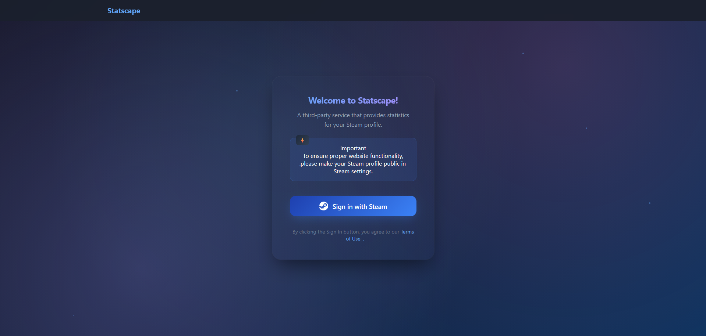
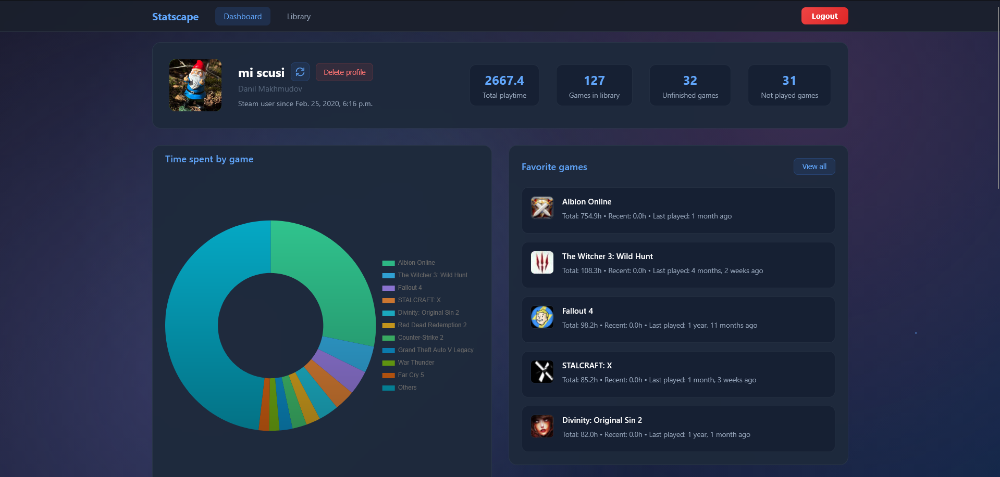
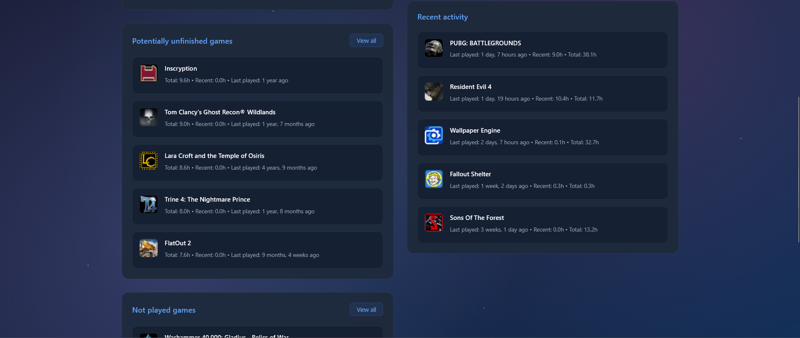
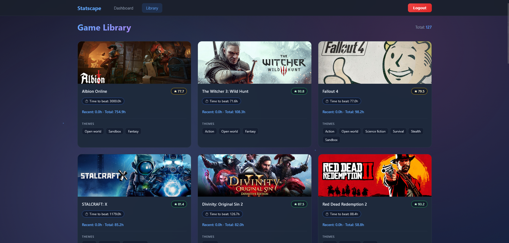
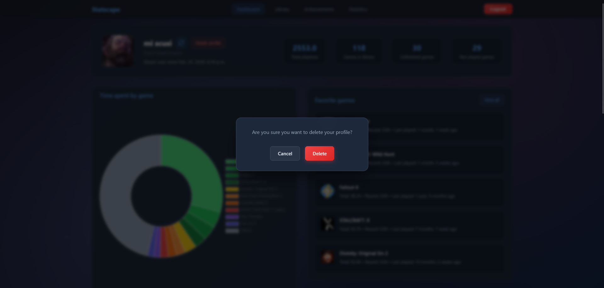

# Statscape | Steam Gaming Analytics Dashboard

**Statscape** collects and analyzes data about user's Steam gaming activity, providing detailed statistics and visualization. The application integrates with **Steam Web API** and **IGDB API** to retrieve complete information about games and the user's gaming profile.

**Note: This project is currently under active development. Some features may be incomplete or subject to change.**

---
## 📸 Screenshots

### Sign In
*Steam OpenID authentication page for secure login*

### Dashboard
*Main dashboard with statistics overview, playtime distribution chart, and favorite games*

### Library
*Visual game library with detailed cards, cover art, and theme tags*

### Sign out
*Sign out confirmation page*

### Delete Profile
*Profile deletion with data removal confirmation*

## ✨ Key Features

### Dashboard
- **User Profile** — Steam profile information with avatar and account details
- **Statistics Overview:**
  - Total playtime across all games
  - Total number of games in library
  - Number of unfinished games
  - Number of not played games
- **Time Distribution Chart** — interactive pie chart showing playtime distribution across games
- **Favorite Games** — ranked list of most played games with:
  - Total playtime
  - Recent playtime
  - Last played date
- **Recent Activity** — list of recently played games with session details
- **Potentially Unfinished Games** — games that might not be completed based on playtime
- **Not Played Games** — games in library that have never been launched

### Game Library
- **Visual Game Cards** — beautiful card-based layout with game cover art
- **Detailed Game Information:**
  - Total and recent playtime statistics
  - Game themes and genres (tags)
  - High-quality game covers from IGDB
- **Library Overview** — total count of games in the collection

## 🛠 Technologies

- **Backend:** Python, Django
- **Frontend:** HTML, CSS, JavaScript
- **Database:** PostgreSQL
- **API:** Steam Web API, IGDB API
- **Authentication:** Steam OpenID Authentication
- **Data Visualization:** Chart.js