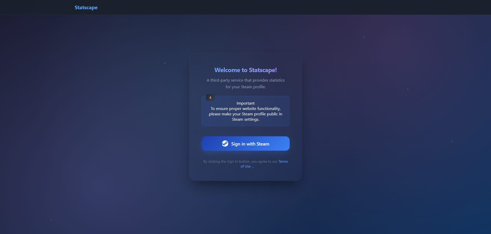
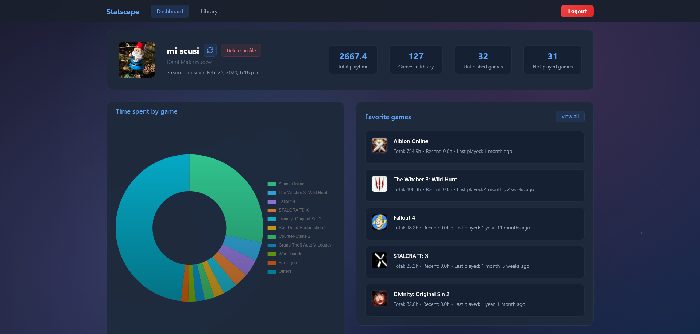
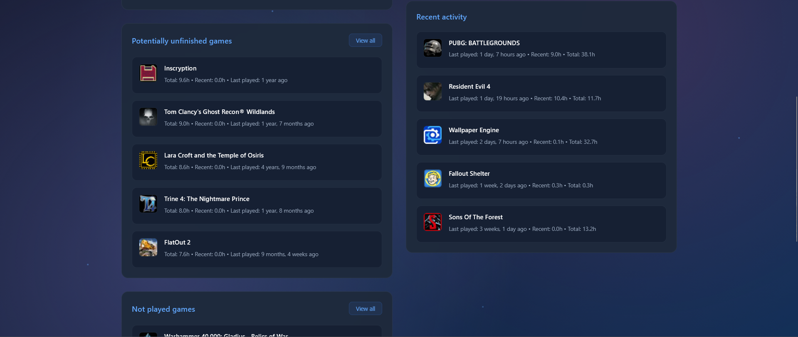
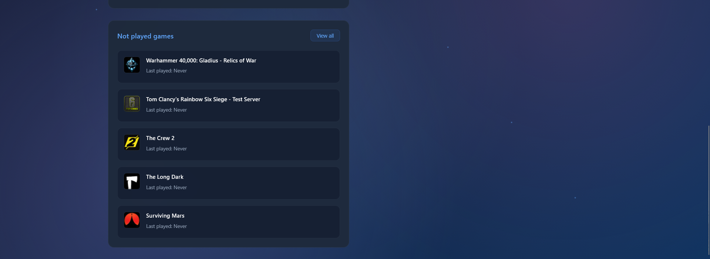
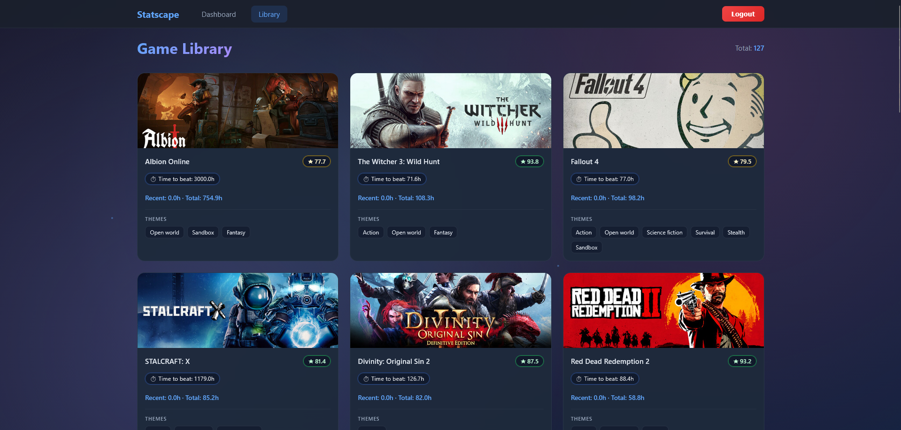
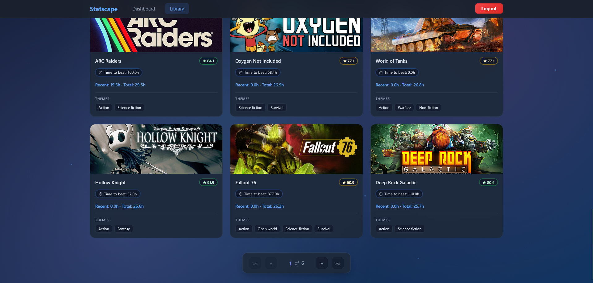
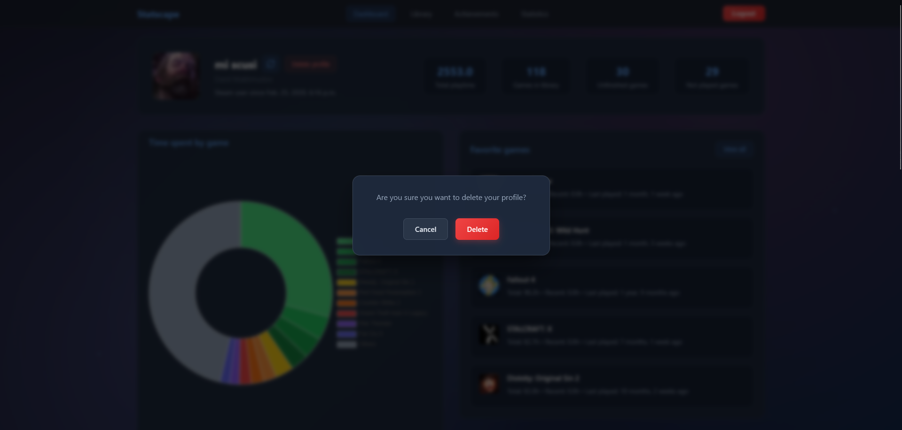

# Statscape | Steam Gaming Analytics Dashboard


**Statscape** collects and analyzes data about user's Steam gaming activity, providing detailed statistics and visualization. The application integrates with **Steam Web API** and **IGDB API** to retrieve complete information about games and the user's gaming profile.

**Project status:** MVP complete. The core user flows are implemented and covered by tests; current work focuses on iterative improvements and UX polish.

---
## 📸 Screenshots

### Sign In
*Steam OpenID authentication page for secure login*


### Dashboard
*Main dashboard with statistics overview, playtime distribution chart, and favorite games*





### Library
*Visual game library with detailed cards(total/recent playtime, rating, time to beat, cover art and theme tags)*



### Sign out
*Sign out confirmation page*


### Delete Profile
*Profile deletion with data removal confirmation*


## ✨ Key Features

### Dashboard
- **User Profile** — Steam profile information with avatar and account details
- **Statistics Overview:**
  - Total playtime across all games
  - Total number of games in library
  - Number of unfinished games
  - Number of not played games
- **Time Distribution Chart** — interactive pie chart showing playtime distribution across games
- **Favorite Games** — ranked list of most played games with:
  - Total playtime
  - Recent playtime
  - Last played date
- **Recent Activity** — list of recently played games with session details
- **Potentially Unfinished Games** — games that might not be completed based on playtime
- **Not Played Games** — games in library that have never been launched

### Game Library
- **Visual Game Cards** — beautiful card-based layout with game cover art
- **Detailed Game Information:**
  - Total and recent playtime statistics
  - Time to beat estimates
  - Community rating
  - Game themes and genres (tags)
  - High-quality game covers from IGDB
- **Library Overview** — total count of games in the collection

## Problem / Goal / My Contribution

### Problem
Steam users can see raw game library data, but it is hard to quickly understand personal playtime patterns, unfinished titles, and meaningful trends.

### Goal
Build a clean analytics dashboard that transforms raw Steam/IGDB data into practical insights: what you play most, what is still unfinished, and what to play next.

### My Contribution
- Designed and implemented backend data flow for Steam and IGDB integrations.
- Built service-layer logic for data enrichment, aggregation, and derived statistics.
- Implemented key dashboard and library views with filtering and pagination.
- Added automated tests for models, views, and service modules.

## Technical Depth

- **Architecture:** Django monolith with clear app boundaries (`users`, `core`) and dedicated service layer for external API/data-processing logic.
- **Data integration pipeline:** Steam library/profile data is fetched, normalized, enriched with IGDB metadata (themes, covers, time-to-beat, rating), then persisted for fast UI rendering.
- **Domain modeling:** Separate entities for games, user-game relations, tags/themes, and token storage;
- **Reliability patterns:** Validation and defensive handling for incomplete API payloads, transactional write paths for consistency, and test-backed behavior for edge cases.
- **Quality:** `pytest` + `pytest-django` test suite covering services, models, and views.

## 🛠 Technologies

- **Backend:** Python, Django
- **Frontend:** HTML, CSS, JavaScript
- **Database:** PostgreSQL
- **API:** Steam Web API, IGDB API
- **Authentication:** Steam OpenID Authentication
- **Data Visualization:** Chart.js
- **Testing:** pytest

## ✅ Tests

The project is covered by automated tests (`pytest`), including:
- Unit tests for service, model, and helper logic
- Integration (smoke) tests for core user flows and view-level behavior

Run tests inside Docker:

```bash
docker compose run --rm web python -m pytest
```

If containers are already running, you can use:

```bash
docker compose exec web python -m pytest
```

## Docker Quick Start

This project can be run locally with Docker Compose (`web` + `db`).

### 1) Build and start containers

```bash
docker compose up --build
```

App will be available at [http://localhost:8000](http://localhost:8000).

### 2) Run migrations manually (optional)

Migrations are already executed on container startup, but you can also run:

```bash
docker compose run --rm web python manage.py migrate
```

### 3) Create a superuser (optional)

```bash
docker compose run --rm web python manage.py createsuperuser
```

### 4) Run tests inside container (optional)

```bash
docker compose run --rm web python -m pytest
```